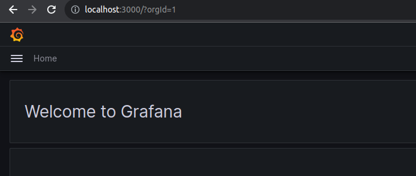
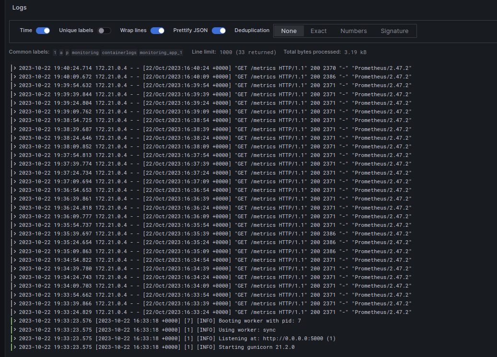
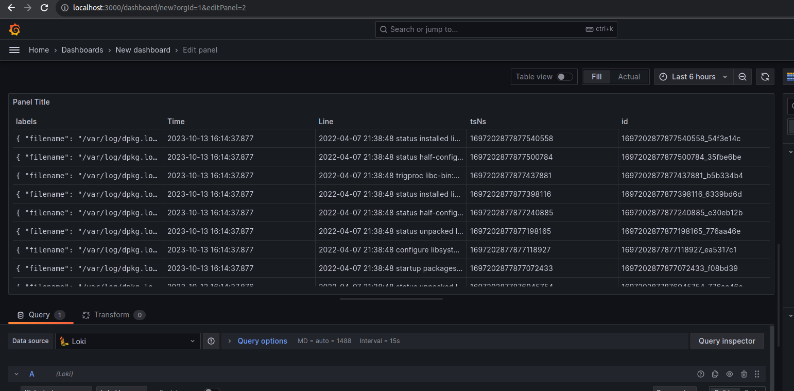

# Logging, Monitoring, and Visualization

## Table of Contents

1. [Overview](#1-Overview)

   1.1. [Grafana](#11-Grafana)

   1.2. [Grafana Loki](#12-Grafana-Loki)

   1.3. [Promtail](#13-Promtail)

2. [Goal](#2-Goal)

3. [Steps](#3-Steps)

   3.1. [Logging](#31-Logging)

   3.2. [Exporting Metrics](#32-Exporting-Metrics)

   3.3. [Preparing Environment](#33-Preparing-Environment)

   3.4. [Demo](#34-Demo)

   3.5. [Dashboards](#35-Dashboards)

4. [Best Practices](#4-Best-Practices)

## 1. Overview

### 1.1. Grafana

- A web application used mainly for visualization and analytics. Once deployed (e.g., as a docker image), it provides a nice UI for creating and customizing **dashboards** with **panels** (containing **graphs**, **bars**, **gauges**, **charts**, etc.) to visualize **metrics** or **logs** collected by a **monitoring** solution (e.g., **Prometheus** or **Grafana Loki**) from different systems or databases.
- It can be used to configure **alerts** and has a **[plugin](https://grafana.com/grafana/plugins/)** system to extend its functionality and integrate with other tools.

### 1.2. Grafana Loki

- A monitoring solution like Prometheus, but focused on application **logs** (collected by **[clients](https://grafana.com/docs/loki/latest/clients/)**) instead of general metrics.
- Logs are stored as compressed objects and indexed for high efficiency, they can be queried using **LogQL**.

### 1.3 Promtail

## 2. Goal

- Prepare a monitoring and visualization environment for the apps as a network of containers (application + Grafana + Loki with Promtail client).
- Configure Loki to monitor logs from all running containers.
- Create a Grafana dashboard to visualize the scraped data.

## 3. Steps

### 3.1. Logging

- Make sure the application generates logs that can be accessed when running the container.
- (Optional) write code to generate application-specific logs:
  - **Python App:** Flask provides `Flask.Logger` which is a standard [`logging`.Logger](https://docs.python.org/3/library/logging.html#logging.Logger)

### 3.2. Exporting logs

- An HTTP endpoint for application logs by Loki

### 3.3. Preparing Environment

- Write a [docker-compose.yml](../monitoring/docker-compose.yaml) for deploying the application with the logging and monitoring stack in a single network [[ref.](https://github.com/grafana/loki/blob/main/production/docker-compose.yaml)].
- Write [configuration files](../monitoring/config) for Loki [[ref.](https://grafana.com/docs/loki/latest/configuration/examples/)], Promtail [[ref.](https://grafana.com/docs/loki/latest/clients/promtail/configuration/)].
  - **Loki configuration** specifies internal settings for Loki server and where to store logs (locally or remotely).
  - **Promtail configuration** contains information on the Promtail server, where positions are stored, and how to scrape logs from files.
- Run the 2 containers with a `command` that specifies config file location.

### 3.4. Demo

- Run `docker-compose up` and verify that all containers are running.

- Verify the application is running at <http://localhost:5000>

  

- Verify that the additional app is running on <http://localhost:8080> 

  

- Verify Grafana UI is accessible at <http://localhost:3000>

  - Default credentials: `admin:admin`

    

- Configuration &rarr; Data source &rarr; Add data source

  - &rarr; Loki &rarr; URL = `http://loki:3100` &rarr; Save and test.

- Explore &rarr; Loki &rarr; Add query &rarr; Write PromQL query or use UI builder.

  - We can see that container logs were scraped successfully.

    

    

### 3.5. Dashboards

- Now we can create interesting dashboards from data collected by Loki and export them as reusable JSON.

  

  

## 4. Best Practices

- Official guides: [Grafana](https://grafana.com/docs/grafana/latest/best-practices/), [Loki](https://grafana.com/docs/loki/latest/best-practices/)
- Create descriptive logs that follow a common format.
- Implement log rotation to save memory and disk space.
- Create simple, easy to interpret dashboards with meaningful names.
- When configuring alerts, try to have them triggered only when attention is needed.
- Avoid unnecessary dashboard reloading to reduce network load.
